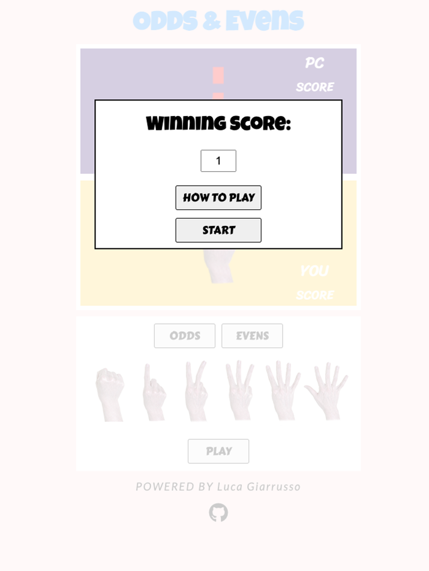
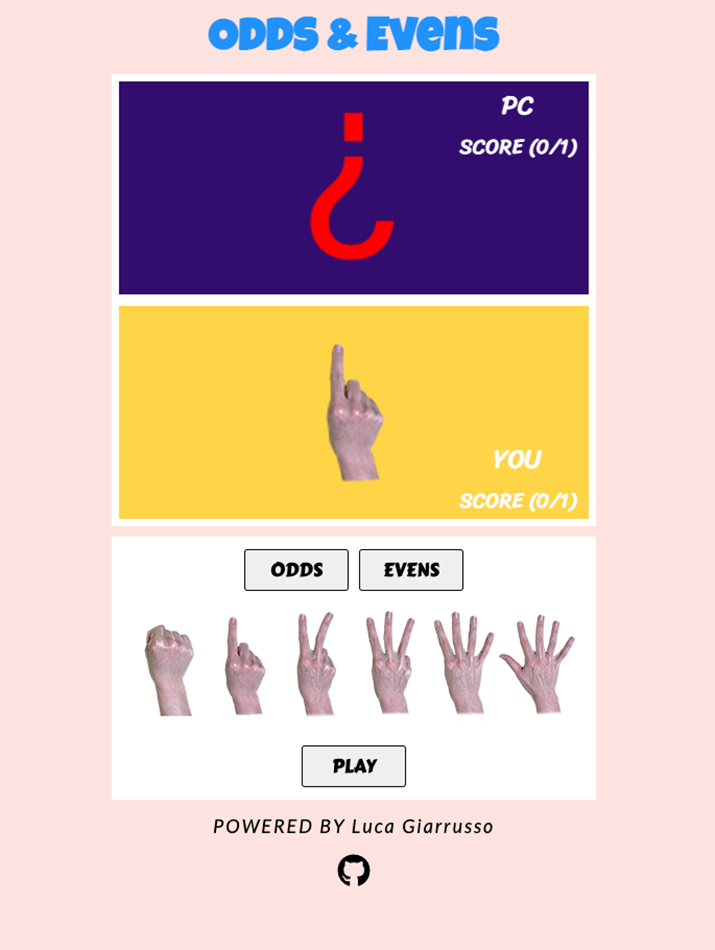
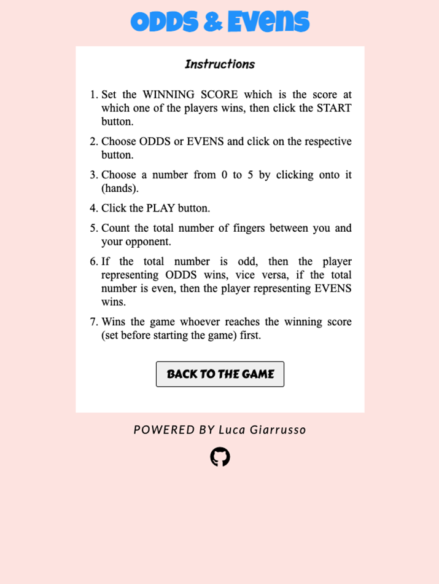

# Odds & Evens

Odds & Evens is a hand game similar to a simplified morra. It is often used as a drawing tool between two contenders, similar to heads or tails with a coin or rock paper or scissors, for example to determine who gets the first turn in a game with two contenders or two teams.
The website is designed to be responsive website allowing visitors to view and browse it on a range of devices.

[Check out Odds & Evens on Github](https://github.com/LucaGiarr/Odds-Evens)

## CONTENTS

* [User Experience (UX)](#User-Experience-(UX))
  * [Initial Discussion](#Initial-Discussion)
    * [Key information for the site](#Key-information-for-the-site)
    * [First Time and Frequent Visitor Goals](#First-Time-and-Frequent-Visitor-Goals)

* [Design](#Design)
  * [Colour Scheme](#Colour-Scheme)
  * [Typography](#Typography)
  * [Imagery](#Imagery)
  * [Wireframes](#Wireframes)
  * [Features](#Features)
  * [Accessibility](#Accessibility)

* [Technologies Used](#Technologies-Used)
  * [Languages Used](#Languages-Used)
  * [Frameworks, Libraries & Programs Used](#Frameworks,-Libraries-&-Programs-Used)

* [Deployment & Local Development](#Deployment-&-Local-Development)
  * [Deployment](#Deployment)
  * [Local Development](#Local-Development)
    * [How to Fork](#How-to-Fork)
    * [How to Clone](#How-to-Clone)

* [Testing](#Testing)
  * [W3C Validator](#W3C-Validator)
  * [JSHint Validator](#jshint-validator)
  * [Solved Bugs](#Solved-Bugs)
  * [Known Bugs](#Known-Bugs)
  * [Lighthouse](#Lighthouse)
    * [Index Page](#Index-Page)
    * [How to Play Page](#how-to-play-page)
  * [Full Testing](#Full-Testing)
  
* [Credits](#Credits)
  * [Code Used](#Code-Used)
  * [Content](#Content)
  * [Media](#Media)
    * [Numbers (hands) Images](#numbers-hands-images)
  * [Acknowledgments](#Acknowledgments)

- - -

## User Experience (UX)

### Initial Discussion

The "Odds & Evens" website is a hand game similar to a simplified morra where the user plays against the pc. He/she, before starting the game, decides the maximum winning score at which one of the two players wins. Whoever reaches the pre-set maximum score wins the game.

#### Key information for the site

* Digital hand game.
* Maximum score settable.

#### First Time and Frequent Visitor Goals

* To make it easy for the user to browse and play the game.
* To be able to play the game on a range of devices with different screen sizes and resolutions.
* To be able to play at any time and anywhere (internet connection required).
* To be able to change the duration of the game setting a higher maximum winning score.

- - -

## Design

### Colour Scheme

The predominant color used in the website is the Misty Rose that covers the background. It matches with the Mustard and the Persian Indigo of the main game area and it also matches with the Dodger Blue of the title. The white color covers the area of the windows and, on the instruction page, the area with the text. The color of the text inside the buttons and the text, in general, is black. The color palette was created using the [Coolors](https://coolors.co/) website.

### Typography

Google Fonts was used for the following fonts:

* Carter One is used for the text in the buttons.

* Luckiest Guy is used for the title.

* Times New Roman is used for the text of the instructions.

* Lato is used for the text in the footer.

* Sriracha is used for the remaining text (labels and text in the white windows).

### Imagery

The images of the numbers (hands) are personal pictures.

### Wireframes

The website was developed in such a way that the user can have the same visual experience regardless of the screen size (hence the device he/she wants to play on).

Wireframes, drawn by hand, are the same for desktop, tablet and mobile and they are linked below.

[First Page Wireframe](docs/wireframes/wireframe1.png)

[Page with the game Wireframe](docs/wireframes/wireframe2.png)

[Info displayed in the white windows Wireframe](docs/wireframes/wireframe3.png)

[Page with the game instructions Wireframe](docs/wireframes/wireframe4.png)

### Features

The website is comprised of two pages; one where the user plays the game (main page) and one with the game instructions.

* All Pages of the website have:

  * The title of the site at the top page and a pink background. 

  * A footer which contains the social media icon link github.

* Main Page.

  

  On this page, the user plays the game. When loaded the page shows a white window with a space to input the winning score and two buttons; one that opens the game instructions page and one that starts the game.
  On this page, if the user does not input a winning score or if the winning score is greater than 9, the user will receive an alert saying "Set the winning score" in the first case and "Max winning score is 9" in the second case.

  
  

  Once the start button is clicked, the winning score will be shown below the players (PC and YOU) on the right side of the colored rectangle (blue and yellow).

  
  

  On this page, the user can make the choice of "ODDS" or "EVENS" and also the number by clicking on the buttons and in the images (hands) respectively.

  

  Once play is clicked the countdown will start, then the random number "chosen" by the pc will show up and a few white windows (similar to the one at the beginning of the game where the user sets the winning score) are shown displaying the sum of the two numbers, if the sum is odd or even, the winner and the score.

  
  
  

  When the game has ended, the user can choose to play again (the winning score of the last game will be kept) or start a new game where he/she can choose a new winning score.

  

* Game Instruction Page.

  The user will be directed to the game instructions page by clicking the "HOW TO PLAY" button before starting the game.
  
  
  

  On this page, the user can read the game instructions and once finished he/she can go back to the game by clicking the "BACK TO THE GAME" button. The user can also click on the GitHub icon to check my projects out.

* Future Implementations.

  * Increase the winning score to more than 9.

  * Allow the user to play against another user and not just against the pc.

### Accessibility

To guarantee to all users to play the game, including the ones with disabilities, I added as many features required as possible to make sure the disability barriers are overcome by:

* Using semantic HTML.
* Using descriptive alt attributes on images.
* Providing information for screen readers where there are icons with no text such as the footer icons.
* Ensuring that there is a sufficient colour contrast throughout the site.

- - -

## Technologies Used

### Languages Used

HTML, CSS and JavaScript were used to create this website.

### Frameworks, Libraries & Programs Used

Git - For version control.

Github - To save and store the files for the website.

Google Fonts - To import the fonts used on the website.

Font Awesome - For the iconography on the website.

Google Dev Tools - To troubleshoot and test features, solve issues with responsiveness and styling.

[Tiny PNG](https://tinypng.com/) To compress images.

[Am I Responsive?](http://ami.responsivedesign.is/) To show the website image on a range of devices.

- - -

## Deployment & Local Development

### Deployment

Github Pages was used to deploy the live website. The instructions to achieve this are below:

1. Log in (or sign up) to Github.
2. Find the repository for this project, Odds-Evens.
3. Click on the Settings link.
4. Click on the Pages link in the left hand side navigation bar.
5. In the Source section, choose main from the drop down select branch menu. Select Root from the drop down select folder menu.
6. Click Save. Your live Github Pages site is now deployed at the URL shown.

### Local Development

#### How to Fork

To fork the Odds-Evens repository:

1. Log in (or sign up) to Github.
2. Go to the repository for this project, LucaGiarr/Odds-Evens.
3. Click the Fork button in the top right corner.

#### How to Clone

To clone the Odds-Evens repository:

1. Log in (or sign up) to GitHub.
2. Go to the repository for this project, LucaGiarr/Odds-Evens.
3. Click on the code button, select whether you would like to clone with HTTPS, SSH or GitHub CLI and copy the link shown.
4. Open the terminal in your code editor and change the current working directory to the location you want to use for the cloned directory.
5. Type 'git clone' into the terminal and then paste the link you copied in step 3. Press enter.

- - -

## Testing

Testing was ongoing throughout the entire build. I utilised Chrome developer tools while building to pinpoint and troubleshoot any issues as I went along.

The following issues were raised during my mid project meeting with my mentor:

* The game was not centred in the mobile view. 

### W3C Validator

The W3C validator was used to validate the HTML on all pages of the website. It was also used to validate all CSS files.

* [Index Page HTML](docs/testing/w3c/w3c-index.png)
* [howtoplay HTML](docs/testing/w3c/w3c-howtoplay.png)
* [style.css CSS](docs/testing/w3c/w3c-style.png)
* [default.css CSS](docs/testing/w3c/w3c-default.png)
* [buttons.css CSS](docs/testing/w3c/w3c-buttons.png)
* [footer.css CSS](docs/testing/w3c/w3c-footer.png)
* [images.css CSS](docs/testing/w3c/w3c-images.png)
* [windows.css CSS](docs/testing/w3c/w3c-windows.png)

### JSHint Validator

The JSHint validator was used to validate the JavaScript code the website.

* [Script JavaScript - Page 1](docs/testing/jshint/script1.png)
* [Script JavaScript - Page 2](docs/testing/jshint/script2.png)
* [Script JavaScript - Page 3](docs/testing/jshint/script3.png)
* [Script JavaScript - Page 4](docs/testing/jshint/script4.png)
* [Script JavaScript - Page 5](docs/testing/jshint/script5.png)
* [Script JavaScript - Page 6](docs/testing/jshint/script6.png)
* [Script JavaScript - Page 7](docs/testing/jshint/script7.png)

### Solved Bugs

1. In the mobile view (but just iphone), when clicked to input the winning score, the whole page would move on the left. I fixed this re-organising the the lements in the html file better and modifying the css files accordingly.

2. When the start button was clicked multiple times the game would run the many times the start button was clicked. I searched a solution on the web and adopted the solution in the websites linked below where it was suggested to disable the button after the first click. 

    https://stackoverflow.com/questions/43514382/disable-multiple-clicks-javascript  

    https://alvarotrigo.com/blog/disable-button-javascript/#:~:text=To%20disable%20a%20button%20using,disabled%20JavaScript%20property%20to%20false%20.

3. To allow for the white windows (displaying info on the sum, the winner, etc) to be displayed one after the other in a timely way, a delay function with async functions were needed. 
Info and code for the function "delay" taken from the websites below. 

    https://linuxhint.com/wait-x-seconds-javascript/ 
    
    https://stackoverflow.com/questions/951021/what-is-the-javascript-version-of-sleep

### Known Bugs

1. In the area of the notch (just iphone), the background color of the page is brighter while the white windows (before starting the game and at the end of the game) are displayed (found in the Iphone 12). 

### Lighthouse

I used Lighthouse within the Chrome Developer Tools to test the performance, accessibility, best practices and SEO of the website.

#### Index Page

Lighthouse testing:

[Lighthouse Testing for Desktop Index Page](docs/testing/lighthouse/index-desk.png)

[Lighthouse Testing for Mobile Index Page](docs/testing/lighthouse/index-mob.png)

#### How to Play Page

Lighthouse testing:

[Lighthouse Testing for Desktop How to Play Page](docs/testing/lighthouse/howtoplay-desk.png)

[Lighthouse Testing for Mobile Index Page](docs/testing/lighthouse/howtoplay-mob.png)

### Full Testing

To fully test my website I performed the following testing using two different browsers (google chrome and safari) and devices (Macbook Pro 13 inch, iPhone 12).

Furthermore, I went through each page using the google chrome developer tool to make sure that the pages are responsive on all different screen sizes.

Links and Buttons.

1. Test each link and button on all pages. Each link and button worked as expected, and any link leading to external pages opened correctly in a seperate browser tab.

- - -

## Credits

### Code Used

* [Delay function - link 1](https://linuxhint.com/wait-x-seconds-javascript/) 

* [Delay function - link 2](https://stackoverflow.com/questions/951021/what-is-the-javascript-version-of-sleep)

* [Prevent buttons to be clicked multiple times - link 1](https://stackoverflow.com/questions/43514382/disable-multiple-clicks-javascript)
* [Prevent buttons to be clicked multiple times - link 1](https://alvarotrigo.com/blog/disable-button-javascript/#:~:text=To%20disable%20a%20button%20using,disabled%20JavaScript%20property%20to%20false%20.)

### Content

Content for the website was written by Luca Giarrusso.

### Media

#### Numbers (hands) Images

* Image are photographs taken by Luca Giarrusso.

### Acknowledgments

I would like to acknowledge the following people who helped me along the way in completing my second milestone project:

* Antonio Rodriguez, my Code Institute Mentor that was very helpfull, available who gave me suggestions and tips on how to approach this project and at the end on the overall look of the website and make sure that the game worked properly and the code validators were all passed.
* [Code Institure](https://codeinstitute.net/ie/), for the lessons (especially the videos related to this project and the ones on the Love Maths project) that were very useful and needful to complete this milestone project.

